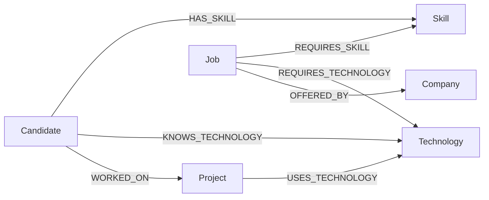
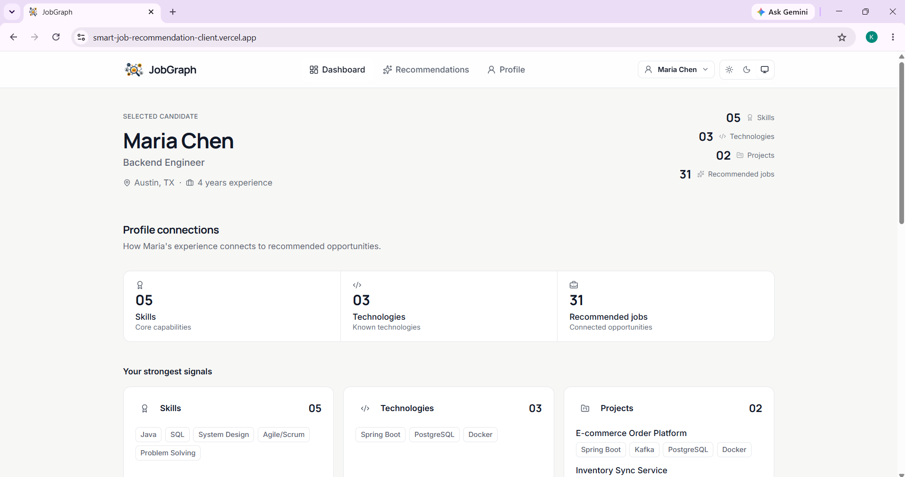
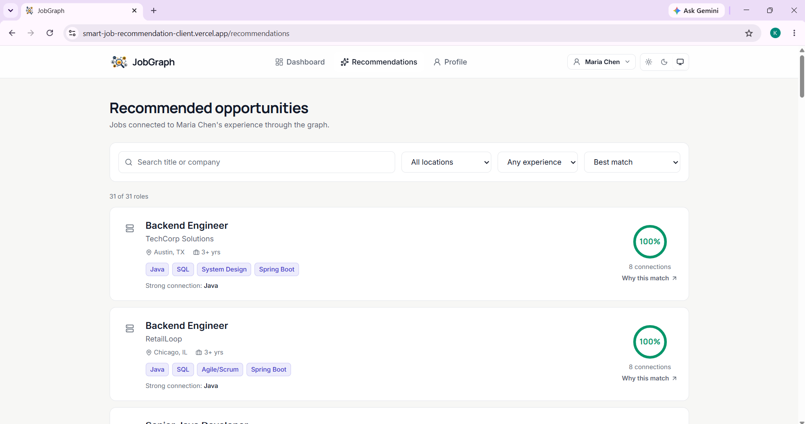
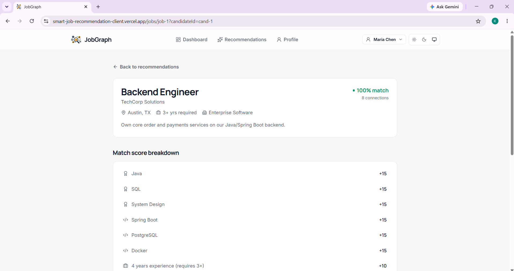
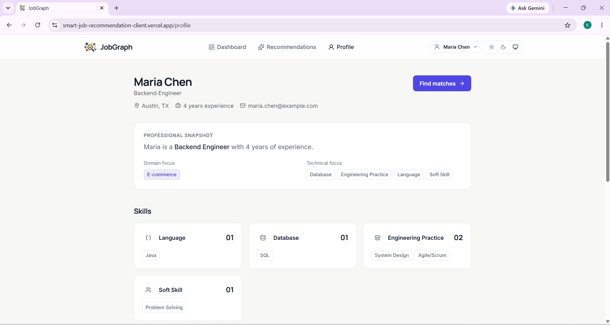

# JobGraph

**JobGraph** is a graph-based job recommendation application. Instead of scoring jobs against a candidate with a hidden formula or a hardcoded percentage, it traverses a real graph of candidates, skills, technologies, projects, jobs and companies stored in **CognoDB** (a Bolt/Neo4j-compatible graph database) — and shows you exactly which relationships produced each recommendation.

> Live Demo: `<DEPLOYED_URL>`
> Screen Recording: `<RECORDING_URL>`

---

## Table of Contents

- [Overview](#overview)
- [Problem](#problem)
- [Why a Graph Database?](#why-a-graph-database)
- [Graph Data Model](#graph-data-model)
- [Architecture](#architecture)
- [Main Graph Queries](#main-graph-queries)
- [Match Score Explained](#match-score-explained)
- [Project Structure](#project-structure)
- [Setup](#setup)
- [Environment Variables](#environment-variables)
- [Seeding the Database](#seeding-the-database)
- [Running the App](#running-the-app)
- [Testing](#testing)
- [Screenshots](#screenshots)
- [Deployment](#deployment)
- [Design Decisions & Trade-offs](#design-decisions--trade-offs)

---

## Overview

JobGraph helps a candidate answer one question: **"which open jobs are actually connected to my experience, and why?"**

A candidate picks their profile, clicks **Find My Matches**, and JobGraph traverses the graph to surface jobs connected to them through:

- skills they've listed,
- technologies they know directly, and
- technologies they picked up on past **projects** — even if those were never explicitly listed as a "known technology."

Every recommendation comes with a transparent **match score** and a **"Why this match?"** view that renders the literal chain of graph nodes that connected the candidate to the job, e.g.:

```
Maria Chen → E-commerce Order Platform → Spring Boot → Backend Engineer → TechCorp Solutions
```

## Problem

Traditional job boards either show every open role, or rank them with an opaque black-box score. Neither answers the question a candidate actually has: *"why is this relevant to me, specifically?"* Answering that well requires following chains of relationships — candidate → project → technology → job — which is exactly what a relational schema is bad at expressing and a graph database is built for.

## Why a Graph Database?

JobGraph's core feature — "find jobs connected to this candidate" — is fundamentally a **traversal problem**, not a lookup problem. Three things matter here that make a graph database the natural fit:

**1. The interesting relationships are multiple hops away, and they compound.**
The most valuable signal in this app isn't "does the candidate have skill X." It's: *"the candidate worked on a project, that project used a technology, and a job requires that technology."* That's a 3-hop path:

```
(Candidate)-[:WORKED_ON]->(Project)-[:USES_TECHNOLOGY]->(Technology)<-[:REQUIRES_TECHNOLOGY]-(Job)
```

In Cypher this is one pattern. In SQL it's a join across `candidate_projects`, `project_technologies`, and `job_technologies` bridge tables — and that's before combining it with the *other* two paths (direct skill match, direct technology match) the recommendation also needs.

**2. The recommendation query has to combine several independent paths into one answer.**
`findJobMatchesForCandidate` (see [`server/src/database/queries/recommendations.ts`](server/src/database/queries/recommendations.ts)) runs three `OPTIONAL MATCH` traversals from a single `Candidate` node and merges them per job. Expressing "give me every job reachable by any of these three paths, and tell me which ones matched" as a single relational query means three separate joins/subqueries unioned together and then re-aggregated — the query plan gets harder to read and reason about with every additional path, while the Cypher pattern stays just as readable no matter how many paths you add.

**3. One query is explicitly awkward in a relational schema: "technologies gained through project work that were never explicitly listed as a skill."**

```cypher
MATCH (c:Candidate {id: $candidateId})-[:WORKED_ON]->(p:Project)-[:USES_TECHNOLOGY]->(t:Technology)
WHERE NOT (c)-[:KNOWS_TECHNOLOGY]->(t)
MATCH (t)<-[:REQUIRES_TECHNOLOGY]-(j:Job)-[:OFFERED_BY]->(company:Company)
RETURN DISTINCT j, company, t, p
```

In SQL, this needs a join from candidates to projects, a join from projects to technologies, a **second, separate** join from candidates to technologies used only to *exclude* rows (`NOT EXISTS` / `LEFT JOIN ... IS NULL`), and a further join from technologies to jobs. That's four joins and an anti-join to express a pattern that, in Cypher, is a single `MATCH` plus a `WHERE NOT (pattern)` clause — and it reads the way you'd describe the rule in English. This exact query powers the "Graph insight" panel on the Recommendations page and the `project_technology` bonus in the match score.

**What we deliberately did *not* need a graph for:** simple lookups like "get this job's details" or "list all candidates" are single-node reads with no interesting traversal — those queries look the same in Cypher as they would in SQL, and we're not pretending otherwise. The graph earns its keep specifically on the multi-hop recommendation logic.

## Graph Data Model



### Nodes

| Label | Properties | Notes |
|---|---|---|
| `Candidate` | `id, name, email, yearsExperience, location, role` | A job seeker with a profile. |
| `Skill` | `id, name, category` | General engineering skills/languages (Java, SQL, System Design...). |
| `Technology` | `id, name, category` | Specific frameworks/tools (Spring Boot, React, Kafka...). Kept separate from `Skill` so "known technology" and "used-on-a-project technology" are unambiguous, distinct signals. |
| `Project` | `id, name, description, duration, domain` | A piece of real work a candidate did. |
| `Job` | `id, title, description, location, experienceRequired, employmentType` | An open role. |
| `Company` | `id, name, industry, location` | The employer behind a job. |

### Relationships

| Relationship | Direction | Properties | Meaning |
|---|---|---|---|
| `HAS_SKILL` | `Candidate → Skill` | — | The candidate lists this skill. |
| `KNOWS_TECHNOLOGY` | `Candidate → Technology` | — | The candidate lists this technology directly. |
| `WORKED_ON` | `Candidate → Project` | `role` | The candidate worked on this project, in this role. |
| `USES_TECHNOLOGY` | `Project → Technology` | — | The project was built with this technology. |
| `REQUIRES_SKILL` | `Job → Skill` | — | The job requires this skill. |
| `REQUIRES_TECHNOLOGY` | `Job → Technology` | — | The job requires this technology. |
| `OFFERED_BY` | `Job → Company` | — | The job is offered by this company. |

We deliberately kept the relationship set small. Every relationship above is read by at least one query in the app (see below) — nothing was added just to make the graph look bigger, per the assignment's own guidance.

## Architecture

```
React + TypeScript (Vite)  →  Express + TypeScript API  →  Neo4j JS Driver  →  CognoDB (Bolt)
     client/                       server/routes                 server/database/connection.ts
```

- **Client** (`client/`): React 18 + TypeScript + Vite + Tailwind CSS. No heavy state library — a small `CandidateContext` remembers the selected profile, everything else is per-page `fetch` + component state.
- **Server** (`server/`): Express + TypeScript. Routes are thin; all business logic (scoring, graph traversal orchestration) lives in `server/src/services`, and every Cypher query lives in `server/src/database/queries`.
- **Database layer**: one shared, lazily-created Neo4j `Driver` (`server/src/database/connection.ts`). Every query opens a short-lived `Session` from that single driver — never a new driver per request. All failures are normalized into `DatabaseUnavailableError`, caught centrally in `server/src/middleware/errorHandler.ts`, and turned into a friendly `503` — the app never crashes because the database is unreachable.

## Main Graph Queries

All three are parameterized (`$candidateId`, `$jobId` — never string-concatenated) and live in [`server/src/database/queries/recommendations.ts`](server/src/database/queries/recommendations.ts).

### 1. Multi-hop recommendation query (3 hops)

```cypher
MATCH (c:Candidate {id: $candidateId})
MATCH (j:Job)-[:OFFERED_BY]->(company:Company)
OPTIONAL MATCH (j)-[:REQUIRES_SKILL]->(reqSkill:Skill)
OPTIONAL MATCH (j)-[:REQUIRES_TECHNOLOGY]->(reqTech:Technology)
OPTIONAL MATCH (c)-[:HAS_SKILL]->(matchedSkill:Skill)<-[:REQUIRES_SKILL]-(j)
OPTIONAL MATCH (c)-[:KNOWS_TECHNOLOGY]->(directTech:Technology)<-[:REQUIRES_TECHNOLOGY]-(j)
OPTIONAL MATCH (c)-[:WORKED_ON]->(:Project)-[:USES_TECHNOLOGY]->(projectTech:Technology)<-[:REQUIRES_TECHNOLOGY]-(j)
WITH c, j, company,
     collect(DISTINCT reqSkill) AS requiredSkills, collect(DISTINCT reqTech) AS requiredTechnologies,
     collect(DISTINCT matchedSkill) AS matchedSkills, collect(DISTINCT directTech) AS directTechnologies,
     collect(DISTINCT projectTech) AS projectTechnologies
WHERE size(matchedSkills) > 0 OR size(directTechnologies) > 0 OR size(projectTechnologies) > 0
RETURN c, j, company, requiredSkills, requiredTechnologies, matchedSkills, directTechnologies, projectTechnologies
```

This is what runs when a candidate clicks **Find My Matches**. It fans out from one `Candidate` node across three paths at once — the third (`WORKED_ON → USES_TECHNOLOGY → REQUIRES_TECHNOLOGY`) is a genuine 3-hop traversal — and only returns jobs actually connected through the graph. Scoring happens afterward in `recommendationService.ts`.

### 2. Graph-native query: technologies discovered through project work

```cypher
MATCH (c:Candidate {id: $candidateId})-[:WORKED_ON]->(p:Project)-[:USES_TECHNOLOGY]->(t:Technology)
WHERE NOT (c)-[:KNOWS_TECHNOLOGY]->(t)
MATCH (t)<-[:REQUIRES_TECHNOLOGY]-(j:Job)-[:OFFERED_BY]->(company:Company)
RETURN DISTINCT j.id AS jobId, j.title AS jobTitle, company.name AS companyName, t.name AS technology, p.name AS projectName
ORDER BY jobTitle ASC
```

Explained in detail in [Why a Graph Database?](#why-a-graph-database). Powers the "Graph insight" panel on the Recommendations page.

### 3. Match explanation query ("Why this job?")

```cypher
MATCH (c:Candidate {id: $candidateId})
MATCH (j:Job {id: $jobId})
OPTIONAL MATCH (c)-[:HAS_SKILL]->(s:Skill)<-[:REQUIRES_SKILL]-(j)
WITH c, j, collect(DISTINCT s.name) AS skillNames
OPTIONAL MATCH (c)-[:KNOWS_TECHNOLOGY]->(t:Technology)<-[:REQUIRES_TECHNOLOGY]-(j)
WITH c, j, skillNames, collect(DISTINCT t.name) AS directTechNames
OPTIONAL MATCH (c)-[:WORKED_ON]->(p:Project)-[:USES_TECHNOLOGY]->(pt:Technology)<-[:REQUIRES_TECHNOLOGY]-(j)
WITH skillNames, directTechNames,
     collect(DISTINCT CASE WHEN p IS NOT NULL THEN { project: p.name, technology: pt.name } END) AS rawProjectPaths
RETURN skillNames, directTechNames, [x IN rawProjectPaths WHERE x IS NOT NULL] AS projectPaths
```

Re-derives every path connecting one specific candidate/job pair, for the "Why this match?" screen — rendered as literal node chains (Candidate → Project → Technology → Job → Company) by `GraphChain.tsx`. Each hop's relationship type (`WORKED_ON`, `USES_TECHNOLOGY`, `REQUIRES_TECHNOLOGY`, `HAS_SKILL`, `REQUIRES_SKILL`, `KNOWS_TECHNOLOGY`, `OFFERED_BY`) is attached to the response in `getMatchExplanation()` (`server/src/services/recommendationService.ts`) - transcribed directly from the exact `MATCH` pattern that produced that path, never inferred on the frontend.

## Match Score Explained

The match score is a **transparent, rule-based score** — not a machine learning prediction. Every point is itemized and shown in the UI (`MatchReasonList.tsx`), so a non-technical user can see exactly why a job scored the way it did:

| Signal | Points | Source |
|---|---|---|
| Each matched required skill | +15 | `HAS_SKILL` ∩ `REQUIRES_SKILL` |
| Each directly-known required technology | +15 | `KNOWS_TECHNOLOGY` ∩ `REQUIRES_TECHNOLOGY` |
| Each required technology discovered only via a project | +12 | `WORKED_ON → USES_TECHNOLOGY` ∩ `REQUIRES_TECHNOLOGY`, excluding technologies already counted as directly known |
| Experience requirement met | +10 | `candidate.yearsExperience >= job.experienceRequired` |
| Experience within 1 year of requirement | +5 | (only if the "met" tier didn't already apply) |
| Location match | +5 | same city, or the job is Remote |

The total is capped at 100. See `scoreJobMatch()` in [`server/src/services/recommendationService.ts`](server/src/services/recommendationService.ts) and its tests in [`server/src/__tests__/recommendationService.test.ts`](server/src/__tests__/recommendationService.test.ts).

## Project Structure

```
jobgraph/
├── client/                        # React + TypeScript + Vite + Tailwind + lucide-react
│   └── src/
│       ├── components/            # CandidateSelector, CandidateHeader, JobListItem, JobPreview, GraphChain,
│       │                          # ProfileConnections, ProfileSignals, SignalCard, SignalMetric, MatchDonut,
│       │                          # MatchReasonList, MatchSummary, ThemeToggle, Drawer, FilterBar, ...
│       ├── pages/                 # Dashboard, Recommendations, JobDetails, CandidateProfile
│       ├── services/api.ts        # Typed fetch wrapper around the API
│       ├── context/                # CandidateContext (selected-candidate, localStorage-backed) + ThemeContext
│       ├── lib/                   # Small pure helpers - match.ts (score thresholds/colors), graphSchema.ts
│       │                          # (node icon/style map), connections.ts (strongest-connections ranking),
│       │                          # roleIcon.ts / categoryIcon.ts, profileSnapshot.ts
│       └── types/                 # Shared TS types (mirrors server/src/types/domain.ts)
│
├── server/                        # Node + TypeScript + Express
│   └── src/
│       ├── config/env.ts          # Centralized, typed env var access
│       ├── database/
│       │   ├── connection.ts      # Shared driver + session lifecycle, graceful failure
│       │   ├── seed.ts            # Seed script (run with `npm run seed`)
│       │   ├── seedData.ts        # Realistic seed dataset
│       │   └── queries/           # All Cypher lives here, parameterized
│       ├── services/              # Business logic (recommendation scoring)
│       ├── routes/                # Thin Express routers
│       ├── middleware/            # Centralized error handling
│       ├── types/                 # Shared domain types
│       └── __tests__/             # Vitest suite
│
├── docs/screenshots/               # README screenshots
├── .env.example
├── .gitignore
└── README.md
```

## Setup

### 1. Create a CognoDB instance

1. Sign up / log in at your CognoDB provider.
2. Create a new free instance.
3. Copy the **Bolt connection URI** (looks like `bolt+s://<instance-id>.databases.cognodb.cloud`).
4. Copy the **username** (commonly `cognodb`) and the **generated password** — CognoDB typically shows the password once, so save it immediately.

### 2. Configure environment variables

```bash
cp .env.example .env
```

Then edit `.env` and fill in `COGNODB_URI`, `COGNODB_USERNAME`, `COGNODB_PASSWORD` (see [Environment Variables](#environment-variables)).

### 3. Install dependencies

```bash
npm install
```

This installs both `server` and `client` workspaces from the repo root.

### 4. Seed the database

```bash
npm run seed
```

### 5. Run the app

```bash
npm run dev
```

This starts the API on `http://localhost:4000` and the client on `http://localhost:5173` (proxying `/api` to the server). Open `http://localhost:5173`.

## Environment Variables

All configuration lives in one root-level `.env` file (git-ignored). See [`.env.example`](.env.example):

| Variable | Required | Description |
|---|---|---|
| `COGNODB_URI` | Yes | Bolt URI, e.g. `bolt+s://<instance-id>.databases.cognodb.cloud` |
| `COGNODB_USERNAME` | Yes | Database username |
| `COGNODB_PASSWORD` | Yes | Database password |
| `COGNODB_DATABASE` | No | Database name (default: `neo4j`) |
| `PORT` | No | API server port (default: `4000`) |
| `NODE_ENV` | No | `development` / `production` / `test` |
| `CORS_ORIGIN` | No | Comma-separated allowed origins for CORS (e.g. `https://app.example.com`). Unset = open CORS, which is fine in dev (the Vite proxy keeps `/api` same-origin) and fine for an early demo deploy - set this once the production frontend URL is finalized |
| `VITE_API_BASE_URL` | No | Overrides the client's API base URL (default: relative `/api`, proxied to the server in dev) |

No credentials are hardcoded anywhere in the codebase — everything is read from `process.env` via `server/src/config/env.ts`, and `.env` is excluded by `.gitignore`.

## Seeding the Database

`npm run seed` runs [`server/src/database/seed.ts`](server/src/database/seed.ts), which:

1. Verifies connectivity to CognoDB.
2. Wipes any existing graph data (`MATCH (n) DETACH DELETE n`).
3. Creates uniqueness constraints on every node label's `id`.
4. Bulk-creates nodes and relationships via parameterized `UNWIND` batches (never string-concatenated Cypher).

The seed data ([`server/src/database/seedData.ts`](server/src/database/seedData.ts)) includes:

- 10 candidates with realistic names, roles, and locations
- 12 skills + 18 technologies
- 16 projects, each tied to a candidate and using 2-4 real technologies
- 35 jobs across 12 companies, each with required skills/technologies
- Several projects deliberately use a technology the candidate never listed as "known" — this is what feeds the graph-native "discovered technology" query.

## Running the App

| Command | Description |
|---|---|
| `npm run dev` | Runs client + server together (recommended for local dev) |
| `npm run dev:server` | Server only, on `PORT` (default `4000`) |
| `npm run dev:client` | Client only, on `5173` |
| `npm run build` | Type-checks and builds both workspaces for production |
| `npm run seed` | Seeds CognoDB with the sample dataset |
| `npm test` | Runs the server test suite |

## Testing

```bash
npm test
```

Runs the Vitest suite in `server/src/__tests__`, covering:

- **Recommendation scoring logic** — every weight, the experience/location tiers, the "discovered via project" de-duplication, and the 100-point cap (`recommendationService.test.ts`).
- **Graceful DB-unavailable behavior** — `getDriver()`, `runQuery()`, and `checkDatabaseConnection()` all fail safely (never throw a raw driver error) when credentials are missing (`connection.test.ts`).

## Screenshots

> Add screenshots after running the app locally or against the hosted demo.

| Dashboard | Recommendations |
|---|---|
|  |  |

| Job Details / Why This Match | Candidate Profile |
|---|---|
|  |  |

## Deployment

Live Demo: `<DEPLOYED_URL>`

A simple deployment path:

1. **Database**: Use your CognoDB cloud instance directly — no separate deployment needed.
2. **Server**: Deploy `server/` (e.g. Render, Railway, Fly.io). Build command: `npm install && npm run build -w server`. Start command: `npm start -w server`. Set `COGNODB_URI`, `COGNODB_USERNAME`, `COGNODB_PASSWORD` as environment variables in the host's dashboard (never in code).
3. **Client**: Deploy `client/` as a static site (e.g. Vercel, Netlify, Render Static Site). Build command: `npm install && npm run build -w client`, publish directory `client/dist`. Set `VITE_API_BASE_URL` to your deployed server's `/api` URL.
4. Run `npm run seed` once (locally, pointed at the production `.env`, or via a one-off job on the host) to populate the live database.

## Design Decisions & Trade-offs

- **No dedicated Graph Explorer page.** The "Why this match?" path visualization already renders real graph traversals as literal node chains, which covers the assignment's visualization goal without the cost/risk of a full pan-and-zoom graph canvas in a 48-hour build.
- **Score is rule-based, not ML.** Explicitly labeled "match score" throughout the UI and README — see [Match Score Explained](#match-score-explained).
- **Skills vs. Technologies are separate node labels** with no overlapping names, so "matched skill" and "matched technology" in the UI are always unambiguous.
- **No auth, no microservices, no Redis/Kafka.** Out of scope for what this assignment is testing (graph modeling, Cypher, full-stack engineering, UI/UX) — see the assignment's own "do not overengineer" guidance.
- **Theming is CSS-variable-based, not a UI kit.** Light (ivory/white + navy + indigo) and dark (black/charcoal + warm beige) are two token sets in `client/src/index.css`, switched via a `data-theme` attribute and a small `ThemeContext`/`ThemeToggle` (Light/Dark/System, persisted to `localStorage`). No CSS-in-JS or theming library.
- **The graph visuals are plain flexbox/SVG-free diagrams, not a graph-rendering library.** `GraphChain` (the literal "why this match" path) and `ProfileConnections`/`SignalCard`/`SignalMetric` (the Dashboard's profile-composition summary, built from `lib/connections.ts`) are all just styled flex layouts - proportionate to how much graph data there actually is per view, and avoids pulling in a canvas/WebGL graph library for a handful of nodes.
